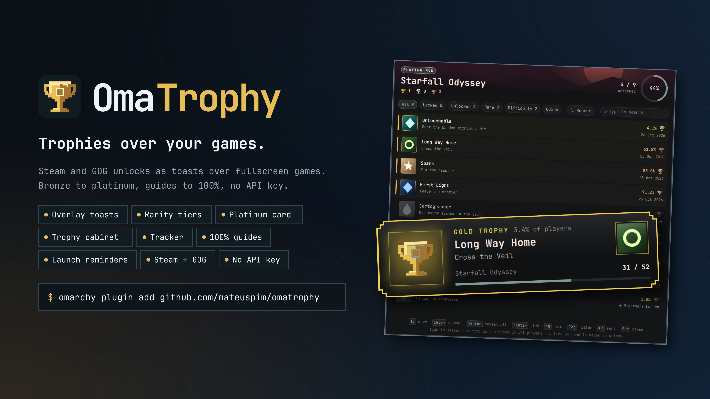
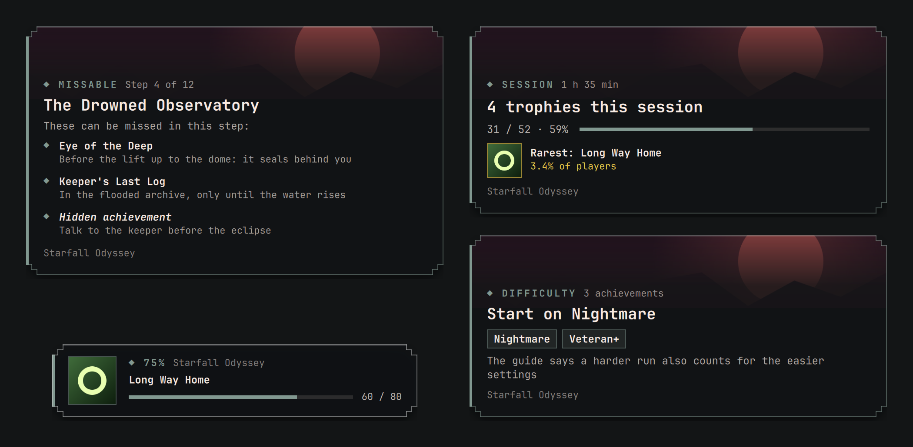
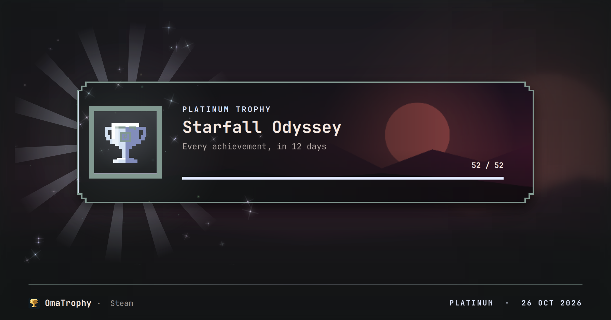
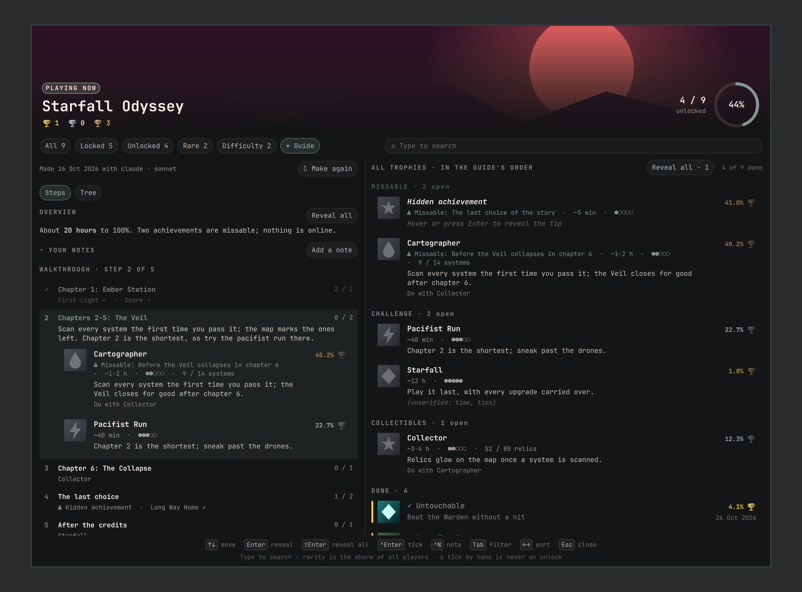
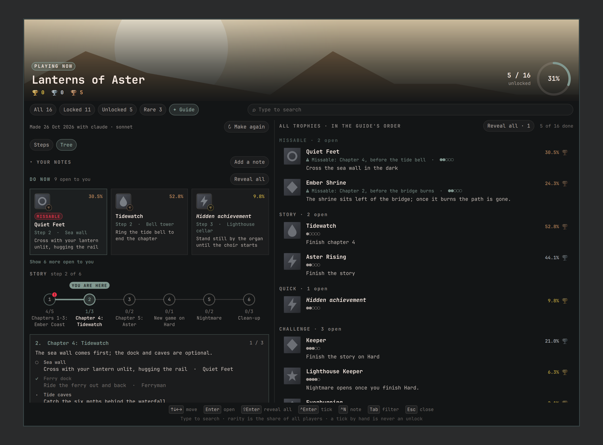

#  OmaTrophy



**Achievement unlocks as trophies over your games, on the Omarchy shell:
bronze, silver and gold by rarity, and a platinum moment when you finish a
game. Steam and GOG (through Heroic); no API key, works with a private
Steam profile.**

## Quick start

```bash
omarchy plugin add https://github.com/mateuspim/omatrophy.git --enable
python3 ~/.config/omarchy/plugins/pym.omatrophy/omatrophy.py test gold
```

Unlock something in a game, or click the trophy in the bar: it shows the
game you're playing and what's left in it, and opens any game's full
achievement list.

## Features

- Toasts on the shell's Overlay layer, so they land over fullscreen games
  even when Steam's own popup doesn't. Click-through; never takes focus.
  On the focused monitor, or the one you pick in Settings > Toasts >
  Screen (`omatrophy.py set screen DP-1`). A disconnected choice falls
  back to the focused monitor. Cards stay on their starting monitor
  unless it disconnects.
- Do Not Disturb respected: while Omarchy's notifications are silenced (the
  bar's bell), cards wait and show when you turn it back on, chimes and
  all. **Show anyway** in Settings > Toasts > Do Not Disturb keeps them
  coming (`omatrophy.py set dnd ignore`); **Try** shows a card either way.
  Ordinary cards stop joining when 20 are queued; launch reminders,
  recaps and explicit tests are kept. A shell exit discards held cards.
- About two seconds from unlock to toast: OmaTrophy reads the launcher's
  local achievement data (Steam's cache, the GOG database Heroic keeps),
  so no Web API key, no login and no public profile.
- Rarity picks the metal: bronze, silver at 35% of players or fewer, gold at
  10% or fewer, with glitter and a sweep of light for gold.
- A platinum card at 100%: the trophy spins in over the game's hero art and
  the count rolls up. **Save image** keeps it as a PNG to share.
- Reminders as a game starts: the difficulty settings its achievements
  left need, so the new save starts on the right one, and, with a guide,
  the trophies you can miss in the step you're on. Once per game or step,
  without a chime ([difficulty](#trophy-cabinet-and-tracker),
  [missables](#100-guides)).
- A recap when you quit a game: how long you played, the trophies the
  session brought, the rarest of them, and where the game stands now.
  Only after a session that unlocked something; no chime, and never
  dropped when many toasts are waiting. Off in
  Settings > Toasts > Recap, where **Try** shows one (`omatrophy.py set
  session-recap off`, `omatrophy.py test recap`).
- Milestones on a grind: a small toast when a locked counter achievement
  ("52 / 80") passes 50, 75 or 90% of its goal, with its icon and a bar.
  Steam only (GOG keeps no counters); hidden ones stay quiet unless you
  reveal hidden ones. Off in Settings > Toasts > Milestones (`omatrophy.py
  set milestones off`, `omatrophy.py test milestone`). Whether Steam
  saves a counter to disk the moment it changes, or only when it next
  writes the game's stats (an unlock, quitting), is unverified, so a
  milestone may come late.
- The achievement icon, its description, the share of players, and your
  progress through the game, filling in as you watch.
- A trophy cabinet in the bar: the game you're playing with this session's
  unlocks and the likeliest next ones, or the last three games you played,
  your rarest unlocks ever or this month, and a shelf of your platinums; every game, eight to a page, filtered as you
  type and sorted by recent, closest to platinum or name, with games you
  won't finish set aside, and platinums you'd rather not show taken off
  the shelf.
- An achievement tracker over the screen: every achievement of a game with
  its rarity, the day you got it, and how far along a counter is ("52 /
  80"); filtered to locked, unlocked or rare, sorted, and searched as you
  type, by mouse or keyboard. Hidden ones stay hidden until you hover or
  press Enter.
- Ticks, counts and notes by hand in the tracker: keep track of what the
  store missed, without changing its unlocks or platinum progress.
- A 100% guide per game, made on request by your own coding agent (Claude
  Code today): the route, missables first, time and difficulty per
  achievement, combos and tips, with every claim checked against the page
  it quotes. The Now tab's Up next follows it.
- Three trophy styles: Omarchy (a pixel grid with an inlay in your theme
  accent), Faceted and Painted.
- Theme-native: cards draw from your Omarchy theme colours.
- A chime per tier, from a short tick for bronze to a ringing bloom for
  platinum, made for OmaTrophy; or the classic desktop sounds, or silence.
- Top centre, top left or top right.
- Steam and GOG today, and built for more: each store is a small module
  ([adding a store](docs/guide/stores.md)).



## Install

```bash
omarchy plugin add https://github.com/mateuspim/omatrophy.git --enable
```

This places a trophy button in the bar. If it doesn't show, run
`omarchy restart shell` once (not while a game runs).

## Update

```bash
omarchy plugin update pym.omatrophy
```

The panel, the tracker and the cards pick up the new files at once; the
watcher behind the toasts keeps running the old copy until
`omarchy restart shell` (not while a game runs). Until then, Settings >
Toasts says the shell runs an older OmaTrophy and offers **Try after
restart** for the cards it doesn't have yet.

## Remove

```bash
omarchy plugin remove pym.omatrophy
rm -rf ~/.config/omatrophy ~/.local/state/omatrophy ~/.cache/omatrophy
```

## Security and privileges

OmaTrophy runs inside `omarchy-shell` as your user. It reads Steam's local
achievement cache and, for GOG, the database Heroic's Comet service keeps, reads whether Omarchy's Do Not Disturb is on, keeps its settings and a small cache in its own folders,
and calls Steam's public endpoints for rarity, game names and art when a
toast shows, the bar panel opens or the watcher starts (game names, once
each). GOG makes no API calls: only its icons and art come from GOG's image hosts. Save image writes a PNG to your
pictures folder (fetching the game's art once if it isn't cached yet); it uploads nothing. No root, no API key, no login. Making a 100%
guide is the one exception, and only when you ask: it runs your own coding
agent, locked to web search and fetch, through its own login. Details in
[SECURITY.md](SECURITY.md).

## Trophy cabinet and tracker

Click the trophy in the bar. The **Now** tab shows your totals, split by
metal with your average completion, then the game
you're playing: its art and progress, what you've unlocked this session and
the three locked achievements most players have. With nothing running it
shows the last three games you played instead (a finished one carries its
platinum date). Below them come your three rarest unlocks across every game,
ever, this month or from your platinums only (click one to open it in the
tracker), and your platinum shelf,
whose empty slots tease the games you're closest to finishing ("2 left"). Before any game has
achievements, the tab says where they come from and points to the Steam
profile switch. The **Games** tab lists every
game with its count, sorted by last played, closest to platinum or name.
Type (or press `/`) to filter by name; Enter opens the first match.
**Difficulty** keeps only the games with a locked achievement that needs a
difficulty setting, and each of those rows names the settings ("Difficulty:
Insanity, Normal+") so you can pick one before you start (see the tracker's
Difficulty filter below). A hidden achievement's setting stays out unless
you reveal hidden achievements in the tracker. The toggle is remembered.
Hover a
game and click **Hide** to set aside one you won't finish: it leaves
Closest and dims in the other sorts until you click **Show**.

The **Profile** tab shows your library at a glance, in tiles after Steam's
profile showcases, each one yours to pick from the tracker:

- **Favorite game**: **+ Choose game** on the tile opens a search of your
  games. Shows its art, hours, trophies and your six rarest unlocks from
  it.
- **Showcase**: click ☆ on up to six earned trophies. Until you do, your
  rarest stand in.
- **Completionist**: click **☆ Completionist** beside a finished game's
  Platinum in the tracker, for up to four games. Until you do, your two newest platinums stand in. Below it:
  games completed, started and average completion.
- **Playtime**: hours in the past two weeks and in all, from the
  launchers' own files.

Hover a pinned tile for **×** to take it off; drag a showcase trophy
sideways to move it.

On multiple monitors, each trophy button opens its own panel. Direct IPC
(`omarchy-shell pym.omatrophy toggle`, also `open` or `close`) controls the
panel on the first screen in Quickshell's screen list.

Click any game for the **tracker**, a card over the screen with every
achievement: rarity, the trophy it would earn, and the date you got it.
Locked counter achievements show how far along you are ("52 / 80") when
the game tracks the count.

### Save a platinum as an image

A finished game's tracker has **⤓ Save image** beside its Platinum, and
each platinum shelf tile shows ⤓ in its corner on hover. Either saves the
platinum card, held open over the game's art with the date along the
bottom, as a 2400 x 1260 PNG in `~/Pictures/omatrophy/` (your XDG
pictures folder), named after the game (`starfall-odyssey-platinum.png`;
saving again replaces it). A notification shows it when it's ready, in a
second or two. It follows your theme and trophy style. The image is drawn
on your machine; the game's art comes from Steam's cache, or is fetched
once from the store when it isn't there yet, as the platinum toast does.
Nothing is uploaded; post it wherever you like.



**Difficulty** (shown only when the game has any) lists the achievements
that need a difficulty setting ("Finish the game on Nightmare"), each
tagged with the one it names (◆ Nightmare), so you can check before
starting a new save. A `+` marks a minimum ("on Normal or higher" is
Normal+), which a harder run also meets; **Hardest** stands for "the
hardest difficulty" and **All** for "on every difficulty". OmaTrophy
reads this from each achievement's own text, so it can miss one the text
doesn't spell out. "On any difficulty" doesn't count, and a hidden
achievement stays out of the filter until you reveal it. With a guide
(made again since this was added: older ones say "older maker"), a line over the list says whether a run
on a harder setting also counts for the easier ones, or each setting needs
a run of its own.

When a game with such achievements left starts, a card names the settings
they need ("Start on Nightmare") and what the guide says about stacking,
once per game, so the first save starts on the right one. It comes
without a chime. Turn it off in Settings > Toasts > Difficulty, where
**Try** shows one (`omatrophy.py set difficulty-reminder off`,
`omatrophy.py test difficulty`).

Its keys:

| Key | Does |
| --- | --- |
| Up, Down (outside the Tree), Page Up/Down, Home, End | Move the list highlight |
| Arrows, Enter (the guide's Tree) | Move between its tiles, stops and trophies; open one |
| Enter (or Space, when not searching) | Reveal a hidden achievement |
| Ctrl+Enter | Tick or untick the highlighted achievement by hand |
| Ctrl+N | Edit its note (or the game's note on Guide with no trophy selected) |
| Ctrl+Up, Ctrl+Down | Raise or lower its count when the guide has a target and the store has no counter |
| Shift+Enter | Reveal all hidden achievements, or hide them again (remembered) |
| Tab, Shift+Tab | All, Locked, Unlocked, Rare, Difficulty, Guide |
| Left, Right (outside the Tree) | Sort: recent, rarest, A–Z, the game's own order (remembered) |
| Any letter | Search; Backspace edits |
| Escape | Clear the search or close picked Tree trophy details; press again to close |

From a script:

```bash
omarchy-shell shell summon pym.omatrophy '{}'   # the running or last game
```

### Ticks, counts and notes by hand

Hover or highlight a locked trophy and click its round tick target, or
press **Ctrl+Enter**, to mark something you finished that the store missed.
It shows **✓ by hand**, with its trophy still dim. The store's unlocks,
percentage, filters, cabinet and platinum stay as they were; the guide's
Up next, steps, Do now and missable reminder count the tick as done. The
header keeps both counts: "47 / 58 unlocked · 1 by hand". Ticks work with
or without a guide; an achievement already unlocked cannot be ticked.
A tick in a guide's `.md` also counts, and unticking it here overrules it
without editing the guide.

When the guide gives a counter target and the store gives no count, **−**
and **+** beside it (or **Ctrl+Down/Up**) keep your count. Reaching the
target does not tick or unlock it. A store counter always takes priority.

Click **Note** on a highlighted or hovered trophy, or press **Ctrl+N**, to
write a plain text note. **Enter** saves, **Shift+Enter** adds a line and
**Escape** cancels; typing while editing stays in the note. Notes hold
1000 characters per trophy. A hidden trophy keeps its note secret until
revealed. On **Guide**, **Your notes** folds open under the overview;
**Add a note** or **Edit** keeps a note on the game, up to 4000 characters,
even without a guide. Emptying a note removes it.

Your writing lives in `~/.local/share/omatrophy/by-hand.json`
(`$XDG_DATA_HOME` respected), beside your guides. Back it up with them;
it is your data, not a disposable cache. OmaTrophy never writes your guide
to tick an item. From a terminal:

```bash
omatrophy.py hand tick steam 1 ACH_SAFE
omatrophy.py hand count steam 1 ACH_RELICS +1
omatrophy.py hand note steam 1 game "Save before the finale."
```

The ids above are examples; use the achievement `api` from `omatrophy.py
game <store> <app>`. [All by-hand commands and storage](docs/specs/by-hand.md).

## 100% guides



The tracker's **Guide** tab shows a game's path to 100%: what to do next,
an overview and the recommended route, then every open achievement by
phase (missable first, then story, quick, challenge, grind, collectibles,
online), each with its time, difficulty, counter, where the point of no
return is, a tip and what it combines with. A hidden achievement keeps its
name and tip secret until you hover it, or **Reveal all** (next to Up
next and the trophy list, or Shift+Enter) shows every one, in every game,
until you hide them again.
Missable means lost for that save: one that chapter select, a mission
replay or free roam brings back isn't, though its tip and its
walkthrough step still warn you to get it on the way (guides made
before 0.9.0 flag more; **Make again** sorts them).
Anything no source backs says
"(unverified)". With a guide, the Now tab's **Up next** follows its route.

A guide with a **walkthrough** leads with it, under a short overview: the
game's chapters or missions in play order, each with its progress
("1 / 3") and its trophies in full, done ones ticked, a ⚠ on the ones you
lose by moving on. The step you're on (the first with a trophy left
after the last chapter you cleared, by its clear trophy; or, in a guide
made before 0.7.0, after the last step you finished) is open; click a
step's title to open or fold it. Trophies no step holds follow under **Not in a step**. Without
a walkthrough, Up next and the route show as before
([ADR 17](docs/adr/0017-walkthrough-is-a-maker-stage.md)). A guide made
before 0.6.1 has none: the tracker says "older maker", and **Make again**
adds one.

Since 0.7.0 the open step also lists what to do there, in order: the
place, then the move, ticked once the trophy it gives unlocks.



**Tree** (beside **Steps**) shows the whole guide at a glance
([ADR 20](docs/adr/0020-requires-and-the-guide-tree.md)):

- **Do now**: every trophy you can get right now (open, and whatever the
  game makes you unlock first is done), in play order from your step;
  a missable of that step comes first. The first three show as tiles
  with where ("Step 2 · Sea wall"), the move, a counter's bar and
  MISSABLE; **Show more** unfolds the rest.
- **Story**: the walkthrough's steps as a track that fills up to **YOU
  ARE HERE**, each with its trophies done ("1/3"). A red **!** marks a
  step you left with a missable still open. Click a step to see its
  actions below the track. Without a walkthrough the story trophies are
  the stops; on a narrow tracker the track runs down the side and a
  step opens right under its own stop.
  OmaTrophy only sees your trophies, so the step you're on is a guess:
  when it's wrong, click your step and **I'm here** (📌 beside YOU ARE
  HERE). The pin holds until you finish that step or a later one, then
  the guess takes over again; **Back to automatic** drops it sooner, and
  a guide made again whose step has another title drops it too. From a
  terminal: `omatrophy.py guide here <store> <app> <step number|clear>`.
- **Chains**: each trophy that needs others first as a small tree, the
  goal on top. A line lights once the trophy under it unlocks; a locked
  one is greyed with a padlock and what it waits for ("needs Keeper and
  1 more"); **READY** (its needs done, itself open) glows. A chain too
  wide for its card scrolls sideways. A source saying a setting opens only after
  another ("Professional is unlocked after Veteran") always makes a
  chain in a guide made since 0.9.0.
- **On their own**: the rest as a grid by phase (click a phase to fold
  it), with a bar for counters.

Click any tile, stop or trophy and the list on the right finds it, while
its tip, what it needs and what it opens show under that part. The Tree
works from the keyboard too: the arrows move a ring from part to part
(Do now, the track, the open step's actions, chains, the grid) by where
each sits, and Enter does what a click does. Up next
leaves out a trophy until what it needs is done. Guides made before
0.7.0 have no actions or chains; **Make again** adds them.

When a game starts whose guide puts you on a step with missables still
open, a card names the step ("Step 4 of 12 · The Drowned Observatory")
and each trophy you lose by moving on, with the guide's note on when
("Before the lift up to the dome"). A hidden one says "Hidden
achievement" unless you reveal hidden ones. It comes once per step: the
next launch on the same step stays quiet, also after you get one of
them, and a new step, or a missable it never named, brings it back. It shows right after
the difficulty reminder, without a chime. Turn it off in Settings >
Toasts > Missable, where **Try** shows one (`omatrophy.py set
missable-reminder off`, `omatrophy.py test missable`).

### The guide over your game

Like Steam's Shift+Tab overlay: a key opens the guide of the game you're
playing over it, and the same key (or Escape) closes it. No guide yet?
**Make guide** is right there. Nothing is bound until you ask: in
**Settings > Guides**, **Install Super+Ctrl+G**. If something already
uses that key, a warning says what, and **Pick a key** records the
next combination you press, with Super, Ctrl, Alt or Shift (checked
against your binds before it's installed; Escape cancels). A key
Hyprland already uses runs its own action and never reaches the
recorder, so it lists combinations free on your system to pick from. **Change**
and **Remove** are there afterwards. OmaTrophy binds the key while the
shell runs and never edits your Hyprland config
([ADR 18](docs/adr/0018-bind-the-guide-key-at-runtime.md)). With nothing
running, the key opens your last game, marked **Nothing running · last
played**.

While the guide is open it takes the keyboard, like the Steam overlay; a
game that pauses when it loses focus pauses
([ADR 16](docs/adr/0016-in-game-guide-is-the-tracker-on-a-key.md)).

### Making a guide

No guide yet? **Make guide** asks your coding agent to write one. OmaTrophy
gathers what it can fetch itself (Steam community guides, pages you saved
by hand in `~/.local/share/omatrophy/guides/sources/<guide name>/`), the
agent searches the web if you let it, classifies the achievements in small
batches and plans the route, and OmaTrophy checks each quote against the
page it came from. It takes a few minutes and keeps going if you close the
tracker; **Stop** leaves the old guide as it was. A cloud agent bills your
account (the guide records the cost it reports). A game you already have at
100% gets no **Make guide**: there is nothing left to plan.

The agent runs headless in an empty folder with no shell and no file
tools, only web search and fetch when it researches
([ADR 14](docs/adr/0014-generate-guides-through-the-users-agent.md)). Claude
Code is checked to stay locked down that way. Codex and OpenCode stay off
until their lock is checked on your machine: **Check** in
**Settings > Guides** asks the agent to write a file and run a command, and
turns it on if it can't (again after the agent updates). Pick the agent (or follow
`omarchy default agent`), its model (any the agent lists, or type another)
and effort in the tracker or in **Settings > Guides**. The model list marks
the [guide bench](docs/guide/guide-models.md)'s best pick for the agent
with ★ (Opus for Claude Code, GPT-6.1 Terra for Codex); the agent's own
default stays until you pick. With
[ai-jail](https://github.com/akitaonrails/ai-jail) installed, **Sandbox**
runs the agent inside it as well. A local model needs its server let in:
**Jail options** under Sandbox (or `guide jail-options`) adds ai-jail
options for the picked agent, such as `--map ~/path/to/key` for a key file
it reads. The jail keeps the network on (the agent searches the web), so a
server on `127.0.0.1` is reachable without `--forward-port`, which ai-jail
refuses next to it. **Check in ai-jail** runs the lock check there to see
that the agent still answers, and `guide jail` says what is installed.
ai-jail 2.x and 3.x both work, with nothing to approve in
`ai-jail configure`: on 3.x OmaTrophy passes the access itself (the
network and the agent's login), and the job's folder is a new one each
run, so no saved ai-jail policy applies to it.
[ai-jail](https://github.com/akitaonrails/ai-jail) is
[Akita](https://github.com/akitaonrails)'s work; OmaTrophy only calls it.

Guides from another folder of `<slug>-<appid>.md` files (with their
`.plan.json`) come in with `guide import`; the folder is only read.

```bash
omatrophy.py guide import ~/path/to/guides     # copy guides in (--replace overwrites)
omatrophy.py set guide-agent claude            # or default: follow omarchy default agent
omatrophy.py guide model claude sonnet medium  # that agent's model and effort; `default` clears
omatrophy.py guide jail                        # is ai-jail installed, the sandbox on, each agent's options
omatrophy.py guide jail-options opencode --map ~/path/to/key  # extra ai-jail options; none clears
omatrophy.py guide make steam 620              # make one; --no-web, --model, --effort for this run
omatrophy.py guide jobs                        # every guide being made, as JSON (up to 3 at once)
omatrophy.py guide stop steam 1774580          # stop one game's; guide stop alone stops them all
omatrophy.py guide steam 620                   # the guide, as JSON
```

Which model writes the best guide? `guide bench` makes one game's guide
with each, side by side, and ranks them by what OmaTrophy can check
(quotes verified, achievements covered, fields filled, the walkthrough's
reach, and since 0.9.0 whether its actions say more than "play on",
whether prerequisites the quotes state are in the chains, and whether
its markers are story clears), with time and cost. Weights:
[docs/specs/guides.md](docs/specs/guides.md#benchmark). `--pick` makes the winner your default; `--keep` keeps its guide.
A model on your own machine takes part through OpenCode (`opencode:<provider/model>`,
once its **Check** passes) or through Claude Code pointed at a local
Anthropic-compatible server:

```bash
omatrophy.py guide bench steam 620 claude:haiku claude:sonnet:medium \
  claude:my-local-model@http://127.0.0.1:8080 --pick
```

One bench on three games (2026-11-06, unreleased guides build, web
research on), scored before the bench measured the walkthrough and
before the 0.9.0 weights (actions, prerequisites, markers), so a bench
today scores differently. Results
vary per game, per run and per machine; full numbers and caveats in
[docs/guide/guide-models.md](docs/guide/guide-models.md).

| Agent · model | Where it runs | Score (small / DLC / big game) | Verified quotes | Coverage | Time (3 games) | Cost (3 games) | Notes |
| --- | --- | --- | --- | --- | --- | --- | --- |
| Claude Code · Opus 5.5, medium | cloud | 95.0 / 88.6 / 88.6 | 90% | 100% | 14 min | $3.15 | best average and verified share |
| Codex · GPT-6.1 Terra, medium | cloud | 88.8 / 91.4 / 85.0 | 77% | 100% | 6 min | plan | fastest; best on the DLC game |
| OpenCode · Qwen3.8 Flash Next, Q2 | local | 86.9 / 82.3 / 87.0 | 75% | 100% | 32 min | $0 | needs working web search |
| Claude Code · Sonnet, medium | cloud | 89.8 / 67.1 / 78.7 | 61% | 100% | 8 min | $1.27 | left one section empty each time |
| Claude Code · Haiku | cloud | 86.9 / 58.6 / 88.4 | 76% | 100% | 14 min | $0.28 | cheapest per-use; uneven |
| Codex · GPT-6 Luna | cloud | 89.6 / 60.0 / 76.1 | 46% | 100% | 8 min | plan | |
| Codex · GPT-6.1 Sol, medium | cloud | 88.8 / 52.5 / 81.5 | 60% | 100% | 12 min | plan | missed every DLC tag on RE7 |

Games: METAL GEAR SOLID V: GROUND ZEROES (13 open), Resident Evil 7
Biohazard (11 open, all DLC), Rise of the Tomb Raider (81 open). "plan":
Codex reports no cost; it bills your ChatGPT plan.

Format and stages: [docs/specs/guides.md](docs/specs/guides.md).

## Settings

The panel's **Settings** tab opens on an **Overview**: one line per
section saying what it is set to; click one, or pick a section above it.
**Toasts** holds the trophy style, then position, glass, the monitor
cards show on (Focused, or each connected monitor by name), what Do Not
Disturb does to them (hold until it ends, or show anyway) and sound as
rows of choices, one row each for the difficulty and
missable reminders, the session recap and milestones (with **Try** to
show one), and **Try it** tiles that show a toast of
each tier with your settings. Each choice applies to the next toast.
**Now tab** picks which sections the Now tab shows. **Guides** picks the
agent that makes 100% guides and its model, each from a list that unfolds
in place (every installed agent with its state; every model the agent
lists, searchable, or any model id you type) and its effort, then whether
it may search the web. In
**Stores**, a card per store says whether OmaTrophy found it and how many
games it has, or what to do when it didn't. In Steam's card, **Profile**
fills in games this machine never ran from your public Steam profile (off
by default), and **Load from Steam** has the Steam client save the
achievements of played games OmaTrophy can't see yet (it shows how many;
the Games tab has the same button), with **Check all again** to retry the
whole library. While a load runs, a bar under the tabs shows it. GOG has nothing to set. Steam also shows its own popup for each unlock; **Turn off in Steam** opens
Steam's Notifications settings: untick Show Toast (and Play Sound) on
"When I unlock an achievement".

From a terminal:

```bash
omatrophy.py set position top-right     # top-center, top-left, top-right
omatrophy.py set sound off              # on, off, omatrophy, classic
omatrophy.py set icons vector           # omarchy, vector, painted
omatrophy.py set glass clear            # clear, frosted, solid
omatrophy.py set screen DP-1            # focused, or a monitor from `hyprctl monitors`
omatrophy.py set dnd ignore             # hold (wait out Do Not Disturb), ignore
omatrophy.py hide steam 20920           # out of "closest to platinum" and the shelf; unhide brings it back
omatrophy.py share steam 20920          # save its platinum as an image (--out file.png); prints where
omatrophy.py test platinum              # bronze, silver, gold, platinum, difficulty, missable, recap, milestone
omatrophy.py status                     # progress of every game
omatrophy.py now                        # the panel's Now tab, as JSON
omatrophy.py game                       # every achievement of the running game
```

The full command list is in [docs/specs/cli.md](docs/specs/cli.md), the
settings file in [docs/specs/settings.md](docs/specs/settings.md).

## Game stores

Steam and GOG are supported today.

### Steam

Native or Flatpak; set `STEAM_DIR` if yours lives elsewhere.

Steam keeps a game's achievements on disk only once its client has
loaded them here: by playing the game, or just by opening its library
page. So a fresh install shows just a few games. With Steam running and no
game open, let OmaTrophy open those pages for you:

```bash
omatrophy.py steam-load          # every played game not tried yet, most played first
omatrophy.py steam-load stop     # from another terminal: stop now
omatrophy.py steam-load all      # try every played game without stats again
```

On Hyprland, Steam's window waits on a hidden workspace while it runs, and
comes back where it was afterwards (Peek shows it meanwhile); the panel
shows the progress on every tab: the game being checked, what was found,
and time left. It takes about a second per game with achievements and 8 s for
one without. Each game is remembered once tried, so a stopped load picks
up where it ended and later loads only take games you played since; only
`all` goes over the whole library again. It stops by itself when a game
starts, Steam closes or Steam isn't signed in (offline, or still signing
in), and after 15 games in a row with no stats, which usually means the
same; those 15 go first next time. Everything stays on this machine
([ADR 13](docs/adr/0013-load-stats-through-the-steam-client.md)).

If your profile and game details are public, you can also fill in games
from your Steam Community profile:

```bash
omatrophy.py set community on   # off by default; sends your SteamID64 to steamcommunity.com
omatrophy.py sync               # optional: fetch now with progress (the watcher also does it)
```

Steam limits how fast a profile can be read, so the watcher fetches a few
pages an hour (15 to start, fewer after Steam says to slow down, more while
it doesn't) and a large library fills in over a day or two. After a rate
limit it waits a few hours, shell restarts included. Settings has
the same switch, and shows how the latest run went. Toasts still
come only from this machine's own data.

### GOG

GOG games played through [Heroic Games Launcher](https://heroicgameslauncher.com)
(`omarchy-install-gaming-heroic`), native or Flatpak. Heroic runs Comet, an
open-source stand-in for GOG Galaxy, beside every GOG game, and Comet keeps
each game's achievements, unlock times and GOG's rarity in a small database
OmaTrophy reads ([ADR 12](docs/adr/0012-read-comets-gameplay-database-for-gog.md)).
Nothing goes online and Heroic's GOG login is never read.

- A game shows once it has run through Heroic. Comet is on by default;
  with it turned off among Heroic's experimental features, nothing is
  recorded.
- Names and art come from Heroic's library, so a game you've
  uninstalled keeps them.
- Set `HEROIC_DIR` or `COMET_DIR` if Heroic or Comet keep their files
  somewhere unusual.

Other launchers plug in as one module each:
[adding a store](docs/guide/stores.md).

## Requirements

- Omarchy 4.0+ with the Quickshell-based `omarchy-shell` (Quickshell and
  Hyprland's `hyprctl` come with it)
- Python 3 (standard library only; no pip packages)
- Steam, or Heroic Games Launcher for GOG (Heroic 2.x with Comet, its
  default), with games that have achievements
- PipeWire's `pw-play` for the chime, and `notify-send` (libnotify) for
  Save image and guide notifications; both ship with Omarchy
- Optional: a coding agent (Claude Code today) to make 100% guides, and
  [ai-jail](https://github.com/akitaonrails/ai-jail) to run it in a sandbox

## Documentation

- [Documentation index](docs/README.md): architecture, decisions, specs and
  runbooks.
- [Troubleshooting](docs/runbooks/troubleshooting.md).
- [Contributing](CONTRIBUTING.md) and [Security](SECURITY.md).

## Development

Link a checkout to `~/.config/omarchy/plugins/pym.omatrophy`, then run
`python3 -m unittest discover -s tests` and `omarchy plugin validate .`.
Preview cards without touching the live shell with `dev/preview.sh`, or
render any view to a PNG with `dev/render.sh`.
Everything is in the [development runbook](docs/runbooks/development.md).

## License

MIT. See [LICENSE](LICENSE).
